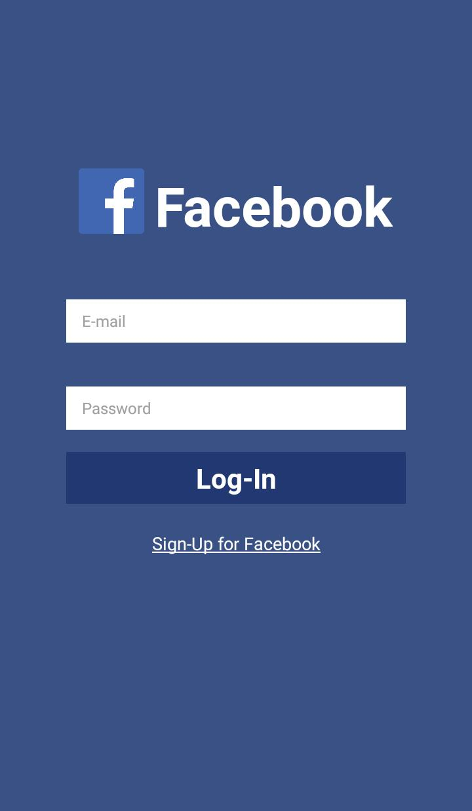

<div align="center">
    <h1>App Typescript/React</h1>
Test interfaces developed in the Application Development classes.
<details><summary>Installations</summary>
  <br />
<p>To install NodeJS follow these instructions:</p>
  <h4>Windows</h4>
  <h5>Using the Website (.exe): https://nodejs.org</h5>
  <h4>Linux Ubuntu</h4>
  <h5>Website: https://nodejs.org</h5>

Updating packages to the stable version of NodeJs.

```shell
$ curl -sL https://deb.nodesource.com/setup_16.x | sudo -E bash -
```

Installation of NojeJS and NPM packages

```shell
$ sudo apt install nodejs
```

Check the NodeJS version

```shell
$ node --version
```

Checks the NPM version

```shell
$ npm --version
```

Installation of required packages:

```shell
$ sudo apt install build-essential
```

Installing the packages for using Expo [GLOBAL]:

```shell
$ sudo npm install expo-cli --global
```

</details>

<details><summary>Create the Project</summary>
  <br />
  
  Access your workspace folder where the folder with the application will be created, and execute the command for creating the application:
  $ expo init rn-first-app
  ```
  
  Go into the folder and start NPM:
  ```shell
  $ cd rn-first-app/ && npm start
  ```
  
  To run the program after installation and startup, just run:
  ```shell
  $ expo start
  ```
</details>

<details><summary>⭐ Screens ⭐</summary>

                                                                        
</details>
